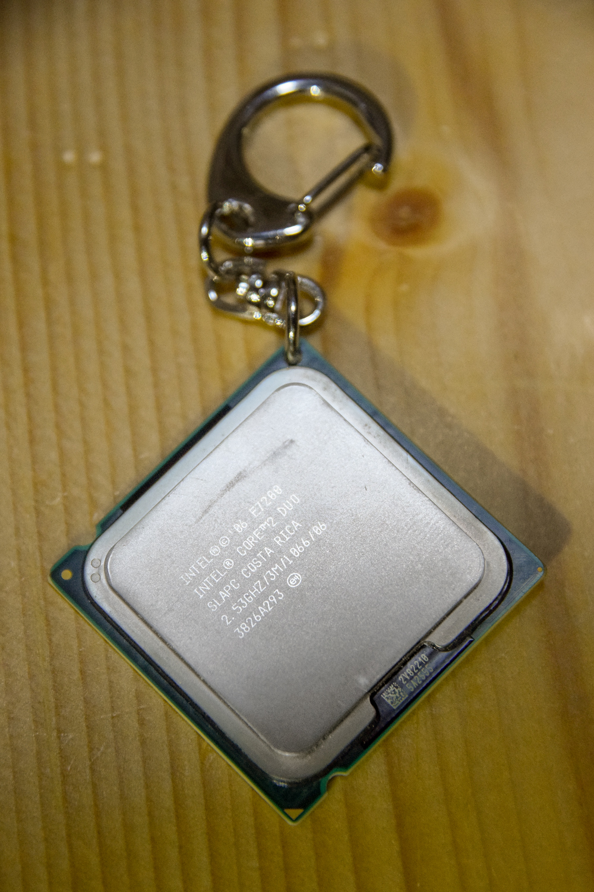

# News

## 2018.11.03 C95参加します！

Last updated on: 2018.12.09

`◎あなたのサークル「ぬるぽ帝国」は、日曜日　東地区“ト”ブロック－54b に配置されました。`
[Webカタログ](https://webcatalog.circle.ms/Circle/14210340)

### 頒布物情報

1. はたらくSEさん Vol.2
    - 新刊/B5/本文44P
    - イコライザ on Raspberry Pi／OpenCVでアニメ顔分類／ディスプレイの制御と走査方式
2. [はたらくSEさん Vol.1](/publications/#%E3%81%AF%E3%81%9F%E3%82%89%E3%81%8Fse%E3%81%95%E3%82%93-vol-1)
    - C94既刊/B5/本文34P
    - waifu2xで動画超解像／SD-WAN入門／ハードウェア丸め処理
3. キーホルダー
    - 本物のCPU or メモリを使っています！

頒布価格: 各500円（予定）

<blockquote class="twitter-tweet" data-lang="ja">
冬コミの本はこれでいきます <a href="https://t.co/9ObxBPHk0v">pic.twitter.com/9ObxBPHk0v</a>
&mdash; えびーむ🍤2日目ト54b (@ebiiiiim) <a href="https://twitter.com/ebiiiiim/status/1060963471221653504?ref_src=twsrc%5Etfw">2018年11月9日</a></blockquote>

<script2 async src="https://platform.twitter.com/widgets.js" charset="utf-8"></script2>

  
##### [過去ログ](/archives/)
