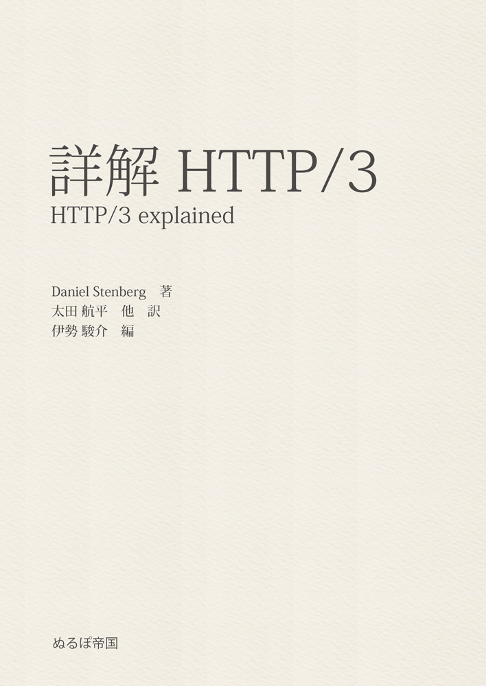
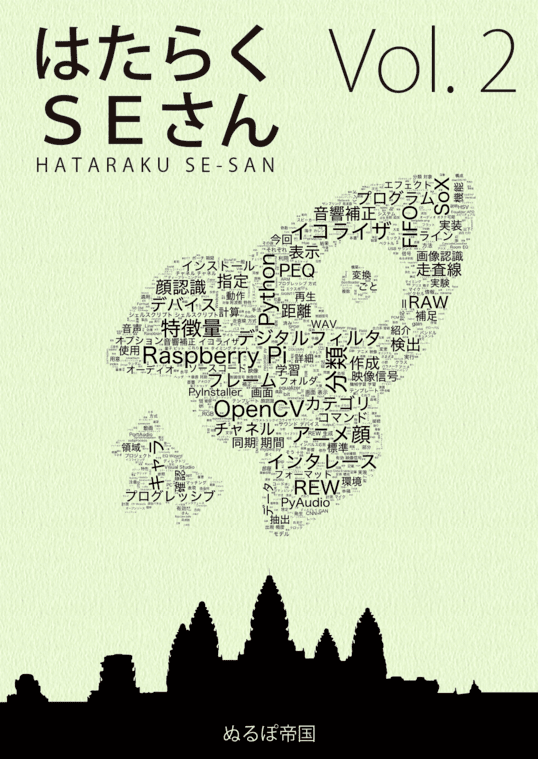

# 刊行物

## PDF版について

紙の本にダウンロードキーが付いています。  
👉[**ぬるぽ書庫**](http://dl.nullpo-t.net)
からフルカラーの最新版をダウンロードできます。

ダウンロードキーがわからない場合は、お手数ですが[mail@nullpo-t.net](mailto:mail@nullpo-t.net)までご連絡ください。

## はたらくSEさん Vol.3

今回はGoでなんかやってます！

- C97発行
- B5サイズ・38ページ
- 著者: えびーむ
- [ISDN278-4-501907-04-1](https://isdn.jp/2784501907041)

#### 目次

- 第１章　Goによるパケット解析
- 第２章　GoでBluetooth Low Energyを扱う
- 出張編　はたらくSEさん＠インド
- 編集後記
- 著者紹介

#### 正誤表

　<!-- ←見た目を調整するための全角スペース-->

👉 初版

## 詳解 HTTP/3

HTTP3 explainedの日本語版です。

- C96発行
- B5サイズ・36ページ
- [ISDN278-4-501907-03-4](https://isdn.jp/2784501907034)
- 原著のライセンスに基づく表示 [☆](https://github.com/nullpo-t/h3diff)

#### 正誤表

　<!-- ←見た目を調整するための全角スペース-->

👉 初版

## はたらくSEさん Vol.2

メンバーの趣味を詰め込んだ本です！少しプログラミングします！

- C95発行
- B5サイズ・40ページ
- 著者: えびーむ・ウミネコ・トキノ
- [ISDN278-4-501907-02-7](https://isdn.jp/2784501907027)

#### 目次

- 第１章　Raspberry Piで作る音響補正用イコライザ
- 第２章　OpenCVを用いたアニメ顔の分類
- 第３章　ディスプレイの制御信号と走査方式
- 編集後記
- 著者紹介

#### 正誤表

　<!-- ←見た目を調整するための全角スペース-->

👉 第2版

<!--
| 位置 | 誤 | 正 | 説明 |
| --- | --- | --- | --- |
| p.18 注釈*22 | https://www.ludd.ltu.se/ torger/brutefir.html | https://www.ludd.ltu.se/~torger/brutefir.html | 誤植 |
| p.27 箇条書き2行目 | ・どのカテゴリにも属しな　　　顔画像（分類対象でないキャラ） | ・どのカテゴリにも属しない顔画像（分類対象でないキャラ） | 誤植 |
-->

<a style="cursor:pointer;">👉 初版</a>

<table>
  <tr>
    <th>位置</th>
    <th>誤</th>
    <th>正</th>
    <th>説明</th>
  </tr>
  <tr>
    <td>p.18 注釈*22</td>
    <td>https://www.ludd.ltu.se/ torger/brutefir.html</td>
    <td>https://www.ludd.ltu.se/~torger/brutefir.html</td>
    <td>誤植</td>
  </tr>
  <tr>
    <td>p.27 箇条書き2行目</td>
    <td>・どのカテゴリにも属しな　　　顔画像（分類対象でないキャラ）</td>
    <td>・どのカテゴリにも属しない顔画像（分類対象でないキャラ）</td>
    <td>誤植</td>
  </tr>
</table>

## はたらくSEさん Vol.1

メンバーの趣味を詰め込んだ本です！

- C94発行
- B5サイズ・34ページ
- 著者: えびーむ・トキノ
- [ISDN278-4-501907-01-0](https://isdn.jp/2784501907010)

#### 目次

- 第１章　動画を超高画質で観たい!!!
- 第２章　次世代WAN入門
- 第３章　ハードウェアから見る丸め処理
- あとがき
- 著者紹介

#### 正誤表

初版第2刷は諸事情により実質改訂版です😇

👉 初版（第2刷）

<!--
| 位置 | 誤 | 正 | 説明 |
| --- | --- | --- | --- |
| p.1 下から2行目 | （嫁を）を | （嫁）を | 誤植 |
| p.4 下から1行目 | より大容量なります。 | より大容量になります。 | 誤植 |
| p.5 コマンド 2行目 | --crf 22 ./output.mp4 | -crf 22 ./output.mp4 | 誤植 |
| p.10 12行目 | 多くの地域ではコストに見合いません。日本やシンガポールなどインターネット回線が発達している地域では、性能が逆転することもよくあります。 | 日本やシンガポールなどインターネット回線が発達している地域では、コストに見合いません。 | 誤植 |
| p.17 注釈*16 | 出典: Viptela - Cisco | 出典: Viptelaのアーキテクチャ - Cisco | 誤植 |
| p.17 注釈*17 | e.g. vEdgeが1台増えると | vEdgeが1台増えると | 誤植 |
| p.20 小々節名 | SIer | システムインテグレータ（SIer）| 補足 |
| p.22 3行目 | 演算可能な高速回路 | 演算できる高速な回路 | 補足 |
| p.23 4行目 | 以下の章 | 次の節 | 誤植 |
| 裏表紙 バーコード2行目 | 1923055005006 | 2923055005005 | 誤植 |
-->

<a style="cursor:pointer;">👉 初版（第1刷）</a>

<table>
  <tr>
    <th>位置</th>
    <th>誤</th>
    <th>正</th>
    <th>説明</th>
  </tr>
  <tr>
    <td>p.1 下から2行目</td>
    <td>（嫁を）を</td>
    <td>（嫁）を</td>
    <td>誤植</td>
  </tr>
  <tr>
    <td>p.4 下から1行目</td>
    <td>より大容量なります。</td>
    <td>より大容量になります。</td>
    <td>誤植</td>
  </tr>
  <tr>
    <td>p.5 コマンド 2行目</td>
    <td>--crf 22 ./output.mp4</td>
    <td>-crf 22 ./output.mp4</td>
    <td>誤植</td>
  </tr>
  <tr>
    <td>p.10 12行目</td>
    <td>多くの地域ではコストに見合いません。日本やシンガポールなどインターネット回線が発達している地域では、性能が逆転することもよくあります。</td>
    <td>日本やシンガポールなどインターネット回線が発達している地域では、コストに見合いません。</td>
    <td>誤植</td>
  </tr>
  <tr>
    <td>p.17 注釈*16</td>
    <td>出典: Viptela - Cisco</td>
    <td>出典: Viptelaのアーキテクチャ - Cisco</td>
    <td>誤植</td>
  </tr>
  <tr>
    <td>p.17 注釈*17</td>
    <td>e.g. vEdgeが1台増えると</td>
    <td>vEdgeが1台増えると</td>
    <td>誤植</td>
  </tr>
  <tr>
    <td>p.20 小々節名</td>
    <td>SIer</td>
    <td>システムインテグレータ（SIer）</td>
    <td>補足</td>
  </tr>
  <tr>
    <td>p.22 3行目</td>
    <td>演算可能な高速回路</td>
    <td>演算できる高速な回路</td>
    <td>補足</td>
  </tr>
  <tr>
    <td>p.23 4行目</td>
    <td>以下の章</td>
    <td>次の節</td>
    <td>誤植</td>
  </tr>
  <tr>
    <td>裏表紙 バーコード2行目</td>
    <td>1923055005006</td>
    <td>2923055005005</td>
    <td>誤植</td>
  </tr>
</table>

